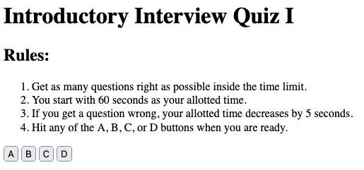

# Introductory Code Quiz I

## Prompt

For February 21st's challenge from my edX web development boot camp, I was tasked with building a rudimentary coding interview quiz from scratch. Given time constraints and life challenges, this is what I was able to accomplish before moving on to other projects.

## Implemented User Story

```
GIVEN I am taking a code quiz
WHEN I click the start button
THEN a timer starts and I am presented with a question
WHEN I answer a question
THEN I am presented with another question
WHEN I answer a question incorrectly
THEN time is subtracted from the clock
WHEN all questions are answered or the timer reaches 0
THEN the game is over
WHEN the game is over
THEN I can save my initials and my score
```

## Features

1. The user is able to be presented questions and viable answers with a 180 second timer.
2. The quiz itself tracks the user's score and time accurately.
3. The quiz's timer decreases by 5 seconds when the user answers incorrectly.
4. The user is able to input and save their score from any completed sessions.
5. No huge bugs are present in any of the mechanics.
6. My sense of humor is very much present in the quiz questions.
7. The page boasts a rather simplistic and readable design, fit for all ages and CPU and GPU qualities.
8. The git has a full ReadMe. Hello, it's me, the ReadMe.

## Mock-Up

The following picture shows the application at rest on launch:



## Deployment

[Here.](https://NoahJRalph.github.io/interview-quiz-I)
